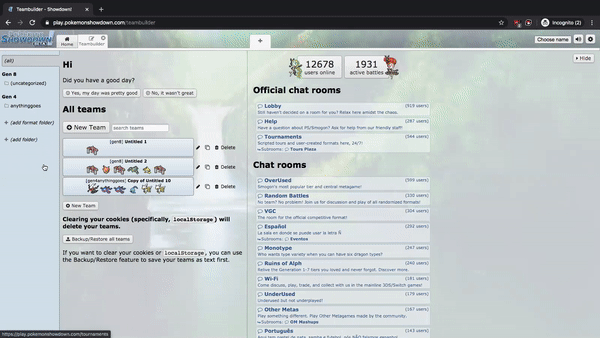

# Pokemon Showdown Team Sync  

This is a chrome extension that can sync teams between browsers on [Pokemon Showdown](https://play.pokemonshowdown.com) using Chrome sync data.

## Demo

## Motivation

Pokemon Showdown includes a teambuilder where users can create teams of Pokemon and battle with them using their online simulator. I use several different computers regularly, and sadly Showdown stores its teams per-browser using `localStorage` in Javascript. This extension will let users sync their Showdown teams between browsers without storing teams on Google Docs, email, [pokepastes](https://pokepast.es/), etc.

## Why a Chrome Extension?

- Chrome extensions are really convenient (sits in the corner of your browser)
- Chrome has a simple API to sync data between browsers
- Can backup/restore without needing to import/export a team manually(!)

## Limitations

- Hard limit of 102,400 bytes synced. Check [the Chrome extension docs](https://developer.chrome.com/extensions/storage#properties) for more information.
  - This is enough for about 140 full teams of 6 Pokemon.
  - I might add an option to save to Google Drive if there's enough interest for higher capacity syncing.
- Buggy/disorganized code. I just made this in a couple of days and I haven't rigorously tested it, but if you have a problem make sure you file a GitHub issue!
- You need to be signed into Google Chrome with a Google account and have Sync enabled.

## TODO:

- [x] Add delete button to backed up teams
- [x] Make options page look nicer
- [x] Add logo
- [x] Load icons manually when user isn't on the team page already
- [x] Backups when icons were not loaded manually still store the icons
- [ ] Publish publicly to Chrome Web Store
- [ ] Add option to back up all if there's enough space
- [ ] Add option to restore all from backup
- [x] Clicking "Backup" rearranges the order of the available cards
- [x] Small ordering bugs - sometimes the order of the cards is unpredictable
- [ ] Optimize the code to run faster
- [x] Hide the injected code from view
- [ ] Fix Javascript error when running `room.update()` without teambuilder open
- [x] Check to make sure we haven't [exceeded limits](https://developer.chrome.com/extensions/storage#properties) in Chrome sync

## Release history

- 0.1.2: Added option to force an update if not already downloaded
- 0.1.1: Fix bug when user backs up team while editing it, update logo
- 0.1.0: Initial release

## Credits

Big thanks to the following resources:

- [Google Developer Docs](https://developer.chrome.com/extensions/getstarted)
- [Sanitize Input for DOM](https://stackoverflow.com/a/48226843/10665534)
- [Basic Hash Function](https://jsperf.com/hashcodelordvlad)
- [Javascript Injection Function](https://stackoverflow.com/a/60873268/10665534)
- [Pokemon Showdown Client GitHub](https://github.com/smogon/pokemon-showdown-client)
- [Bootstrap](https://getbootstrap.com/)
- [Font Awesome](https://fontawesome.com/)
  - [License here](https://fontawesome.com/license), changes were made to the "Sync" glyph - added a Pokeball

And the hundreds of other StackOverflow pages and random JavaScript references I used but can't recall.
